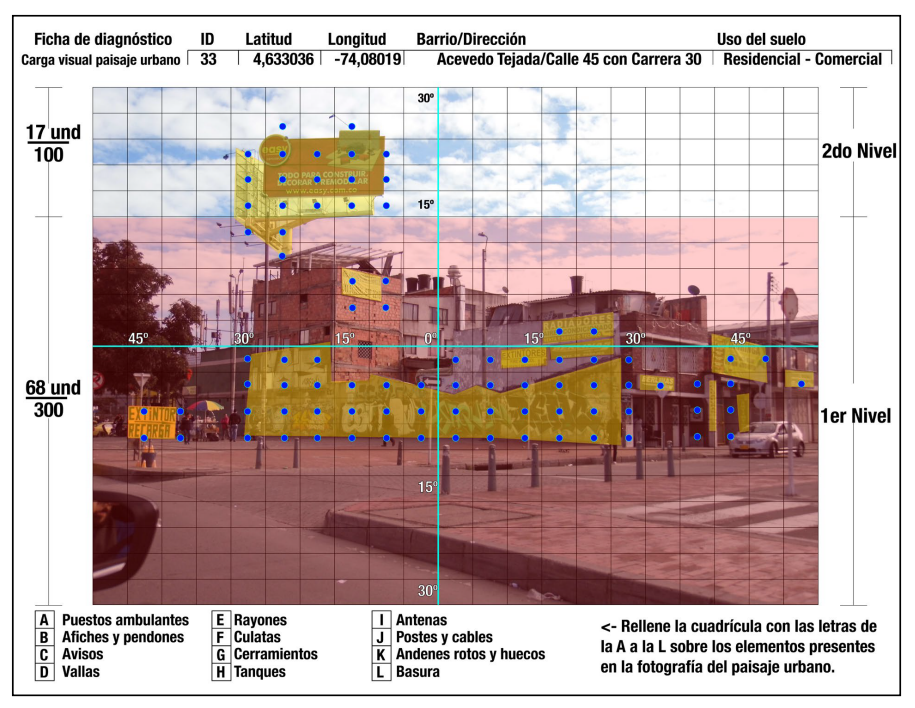
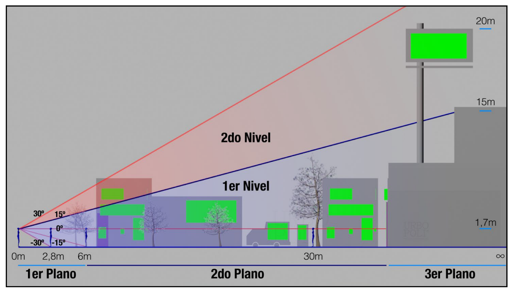

<!-- README.md is generated from README.Rmd. Please edit that file -->

```{r, include = FALSE}
knitr::opts_chunk$set(
  collapse = TRUE,
  comment = "#>",
  fig.path = "man/figures/README-",
  out.width = "100%"
)
```

# icvgridd

<!-- badges: start -->
<!-- badges: end -->

La contaminación visual es un efecto en la percepción del espectador, el cual está compuesto por el desorden y el exceso de imágenes dentro de su campo visual. Los estudios demuestran que este tipo de contaminación tiene impactos sobre la salud de las personas, tales como: el estrés, dolor de cabeza, cansancio visual, percepción de amenaza, perturbaciones, incomodidad y distracción excesiva.


La contaminación visual le resta valor a la calidad paisajística de las ciudades, bloqueando la visibilidad de las vías públicas de circulación peatonal, convirtiéndose en un elemento distractor para las personas y conductores. Afectan también la interrelación de las personas con el entorno natural afectando la percepción visual de los paisajes naturales.



Fuente: Carlos Arango Et. Al. 2020.

## Metodologia

La metodología de evaluación consiste en la identificación de los elementos visuales considerados como generadores de carga visual en el paisaje, para tal fin, se emplean instrumentos que combinan el uso de indicadores de parametrización como las retículas y estimaciones subjetivas dadas por observadores. Para esto se expone a los observadores a fotografías que emulan el plano de imagen retiniana, para luego hacer valoraciones sobre la dificultad de procesar la estimulación visual urbana (Chmielwski et al., 2016).

Según el libro “The perception of Depth” del 2011, existe un área en la cual, el conjunto de puntos en el espacio visual tiene su correspondiente imagen proyectada en las dos retinas, las cuales están definidas por mecanismos internos de representación perceptual. Esta área es denominada como Área de fusión de Panum; estas disposiciones de orden funcional se utilizan en la actualidad para el diseño de pantallas en dispositivos de rastreo de actividad oculomotora (Holmqvist et al., 2011).

De lo anteriormente planteado, se colecta la información de la percepción visual de un observador respecto de una fotografía horizontal, la cual se divide en retículas de igual tamaño y a su vez se agrupan formando dos niveles, bajo los siguientes criterios:

- Primer nivel (A); hace referencia al plano más próximo a ser percibido por el observador y se encuentra enmarcada hasta los 15° por encima de la línea horizontal de visión, abarcando un espacio equivalente a los ¾ de una
fotografía.

- Segundo nivel (B); hace referencia al plano más alejado de percepción, enfocándose en el campo de visión periférica. Es el campo que está por debajo de los 30° desde la línea horizontal de la visión y es equivalente a ¼ de la fotografía (ver imagen campos visuales de primer y segundo nivel).
Este indicador fue construido por el Departamento Administrativo Nacional de Estadística, en Colombia (DANE).


Tomada la fotografía esta es dividida en 400 cuadriculas que simulan la distribución de los componentes objetivos espaciales percibidos por el espectador. Para cada una de las fotografías se tomará registro del número de cuadriculas en las cuales se perciba la presencia de algún elemento generador de carga visual (detallados



Fuente: Carlos Arango Et. Al. 2020.

## Instalacion

Para instalar la version en desarrollo de `icvgridd` desde [GitHub](https://github.com/) puedes usar:

``` r
# install.packages("devtools")
devtools::install_github("PaulESantos/icvgridd")
```

## Ejemplo

Para usar la función `add_icvgrid()` debes tener en cuenta la resolución de las imágenes y que las imágenes debe estar guardadas en una carpeta de trabajo especifica.


```{r example}
library(icvgridd)

```

- Listar la ruta de las imagenes:

```{r eval=FALSE}
## basic example code
img <- icvgridd::read_icv_images(fs::path_package(package = "icvgridd",
                                            "images"))
img
```

- Agregar la cuadricula a las imágenes:

```{r eval=FALSE}
add_icvgrid(img_path = img, save = FALSE)
```


