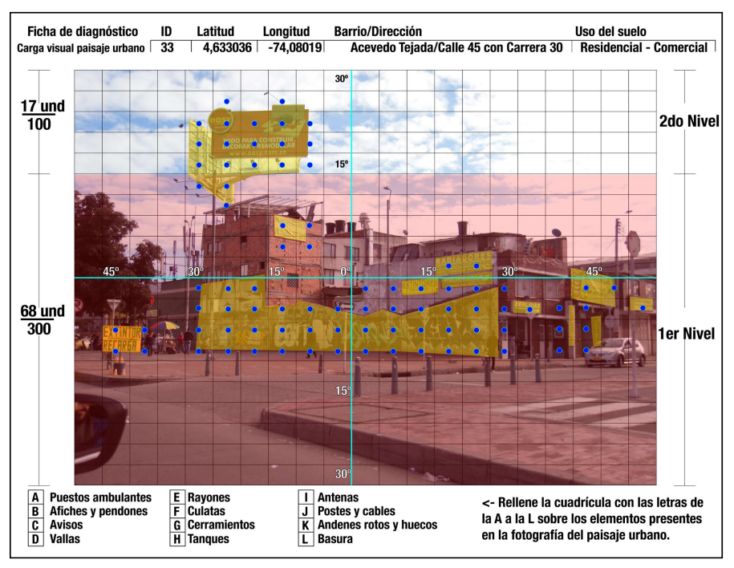

<!-- README.md is generated from README.Rmd. Please edit that file -->

# icvgridd

<!-- badges: start -->
<!-- badges: end -->

La contaminación visual es un efecto en la percepción del espectador, el
cual está compuesto por el desorden y el exceso de imágenes dentro de su
campo visual. Los estudios demuestran que este tipo de contaminación
tiene impactos sobre la salud de las personas, tales como: el estrés,
dolor de cabeza, cansancio visual, percepción de amenaza,
perturbaciones, incomodidad y distracción excesiva.

La contaminación visual le resta valor a la calidad paisajística de las
ciudades, bloqueando la visibilidad de las vías públicas de circulación
peatonal, convirtiéndose en un elemento distractor para las personas y
conductores. Afectan también la interrelación de las personas con el
entorno natural afectando la percepción visual de los paisajes
naturales.



Fuente: Carlos Arango Et. Al. 2020.

## Metodologia

La metodología de evaluación consiste en la identificación de los
elementos visuales considerados como generadores de carga visual en el
paisaje, para tal fin, se emplean instrumentos que combinan el uso de
indicadores de parametrización como las retículas y estimaciones
subjetivas dadas por observadores. Para esto se expone a los
observadores a fotografías que emulan el plano de imagen retiniana, para
luego hacer valoraciones sobre la dificultad de procesar la estimulación
visual urbana (Chmielwski et al., 2016).

Según el libro “The perception of Depth” del 2011, existe un área en la
cual, el conjunto de puntos en el espacio visual tiene su
correspondiente imagen proyectada en las dos retinas, las cuales están
definidas por mecanismos internos de representación perceptual. Esta
área es denominada como Área de fusión de Panum; estas disposiciones de
orden funcional se utilizan en la actualidad para el diseño de pantallas
en dispositivos de rastreo de actividad oculomotora (Holmqvist et al.,
2011).

De lo anteriormente planteado, se colecta la información de la
percepción visual de un observador respecto de una fotografía
horizontal, la cual se divide en retículas de igual tamaño y a su vez se
agrupan formando dos niveles, bajo los siguientes criterios:

- Primer nivel (A); hace referencia al plano más próximo a ser percibido
  por el observador y se encuentra enmarcada hasta los 15° por encima de
  la línea horizontal de visión, abarcando un espacio equivalente a los
  ¾ de una fotografía.

- Segundo nivel (B); hace referencia al plano más alejado de percepción,
  enfocándose en el campo de visión periférica. Es el campo que está por
  debajo de los 30° desde la línea horizontal de la visión y es
  equivalente a ¼ de la fotografía (ver imagen campos visuales de primer
  y segundo nivel). Este indicador fue construido por el Departamento
  Administrativo Nacional de Estadística, en Colombia (DANE).

Tomada la fotografía esta es dividida en 400 cuadriculas que simulan la
distribución de los componentes objetivos espaciales percibidos por el
espectador. Para cada una de las fotografías se tomará registro del
número de cuadriculas en las cuales se perciba la presencia de algún
elemento generador de carga visual (detallados


Fuente: Carlos Arango Et. Al. 2020.

## Instalacion

Para instalar la version en desarrollo de `icvgridd` desde
[GitHub](https://github.com/) puedes usar:

``` r
# install.packages("devtools")
devtools::install_github("PaulESantos/icvgridd")
```

## Ejemplo

Para usar la función `add_icvgrid()` debes tener en cuenta la resolución
de las imágenes y que las imágenes debe estar guardadas en una carpeta
de trabajo especifica.

``` r
library(icvgridd)
#> icvgridd is using ExifTool version 12.22
## basic example code
```
